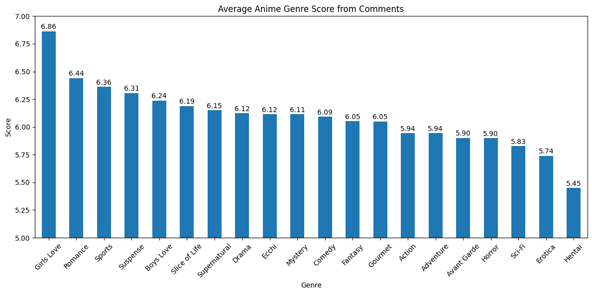
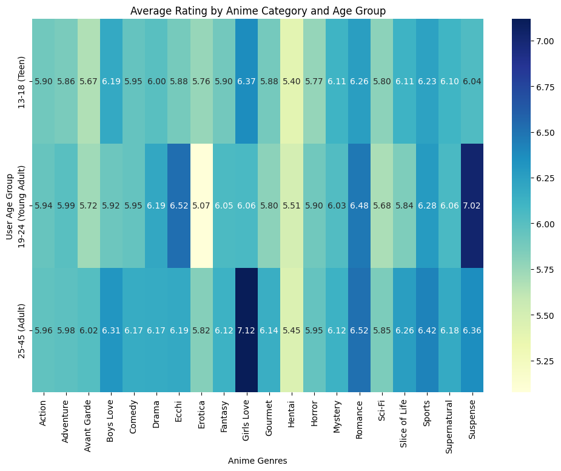
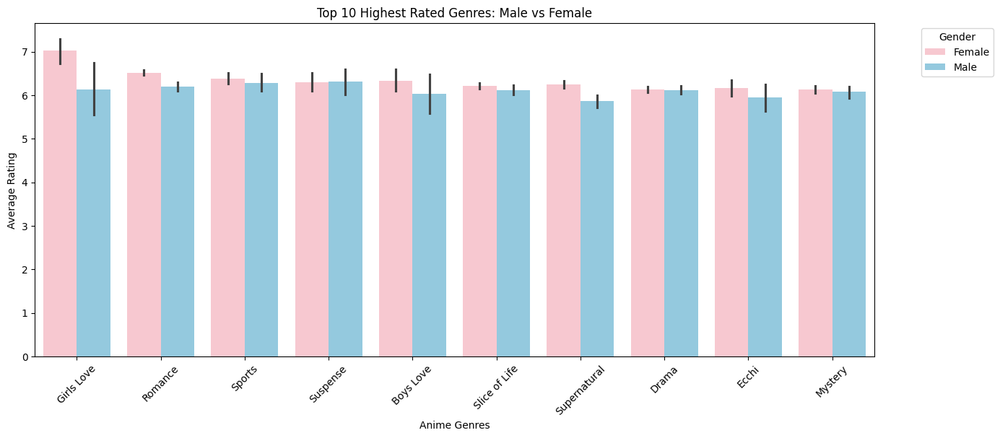
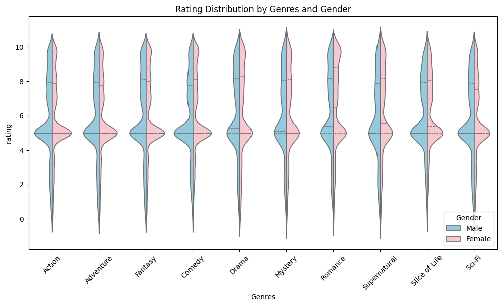

# 📊 Anime Genres Rating Analysis 2025

โปรเจกต์วิเคราะห์ข้อมูลเรตติ้งของอนิเมะประเภทต่างๆ ในปี 2025 โดยเน้นการเปรียบเทียบระหว่างช่วงอายุ เพศ และประเภทของเนื้อหา เพื่อหา Insight ว่ากลุ่มผู้ชมแต่ละกลุ่มมีความชื่นชอบที่แตกต่างกันอย่างไร

---

## 📈 สรุปผลการวิเคราะห์ข้อมูล (Visualized Analysis)

ในส่วนนี้เป็นการนำเสนอข้อมูลผ่านกราฟต่างๆ เพื่อให้เห็นภาพรวมของตลาดอนิเมะในปีนี้

### 1. เรตติ้งเฉลี่ยแบ่งตามประเภทอนิเมะ (Average Rating by Genre)

  

> **คำอธิบาย:** กราฟแท่งแสดงค่าเฉลี่ยเรตติ้งของอนิเมะในแต่ละแนว (Genre) ช่วยให้เห็นว่าในปี 2025 แนวไหนที่ได้รับความนิยมสูงสุดและครองใจผู้ชมในภาพรวม โดยจะเห็นการเรียงลำดับจากแนวที่เรตติ้งสูงไปหาต่ำ

---

### 2. ความสัมพันธ์ระหว่างเรตติ้งกับช่วงอายุ (Rating vs. Age Group)

  

> **คำอธิบาย:** กราฟเปรียบเทียบระดับคะแนนตามช่วงอายุ (เช่น เด็ก, วัยรุ่น, ผู้ใหญ่) เพื่อวิเคราะห์ว่ากลุ่มอายุใดมีแนวโน้มให้คะแนนอนิเมะสูงกว่ากัน และช่วยระบุว่าเนื้อหาประเภทนั้นๆ ตอบโจทย์กลุ่ม Target Audience หลักหรือไม่

---

### 3. การเปรียบเทียบเรตติ้งระหว่างเพศ (Rating by Gender)
| Male vs Female Comparison |
| :---: |
|  |

> **คำอธิบาย:** กราฟเปรียบเทียบค่าเฉลี่ยเรตติ้งระหว่างผู้ชมเพศชายและเพศหญิง เพื่อดูความแตกต่างของรสนิยมและการยอมรับในคุณภาพของอนิเมะที่รับชม

---

### 4. การกระจายตัวของเรตติ้งในแต่ละเพศ (Rating Distribution by Gender)

  

> **คำอธิบาย:** กราฟแสดงความหนาแน่นและการกระจายตัวของคะแนน (Distribution) ของผู้ชมแต่ละเพศ ช่วยให้เราเห็นภาพว่าคะแนนส่วนใหญ่อัดตัวกันอยู่ที่ช่วงใด (เช่น 7-8 คะแนน) และมีกลุ่มที่ให้คะแนนสุดโต่ง (Outliers) มากน้อยเพียงใด

---

## 🛠 Tools Used
* **Python** (Pandas, Matplotlib, Seaborn) สำหรับการทำ Data Visualization
* **Markdown** สำหรับการจัดทำรายงานบน GitHub

---

## 📂 แหล่งข้อมูล (Data Sources)

ข้อมูลทั้งหมดที่นำมาวิเคราะห์ในโปรเจกต์นี้ รวบรวมและอ้างอิงจากแพลตฟอร์มหลักในวงการอนิเมะ เพื่อให้ได้ผลลัพธ์ที่ครอบคลุมและแม่นยำที่สุด:

   &nbsp;&nbsp;&nbsp;&nbsp;
   &nbsp;&nbsp;&nbsp;&nbsp;
  

* **MyAnimeList & AniList & YouTube:** ใช้สำหรับดึงข้อมูล Rating, Genre และ Comment ของอนิเมะแต่ละเรื่อง

---

  <i>Created with ❤️ for Anime Community Analysis 2025</i>

